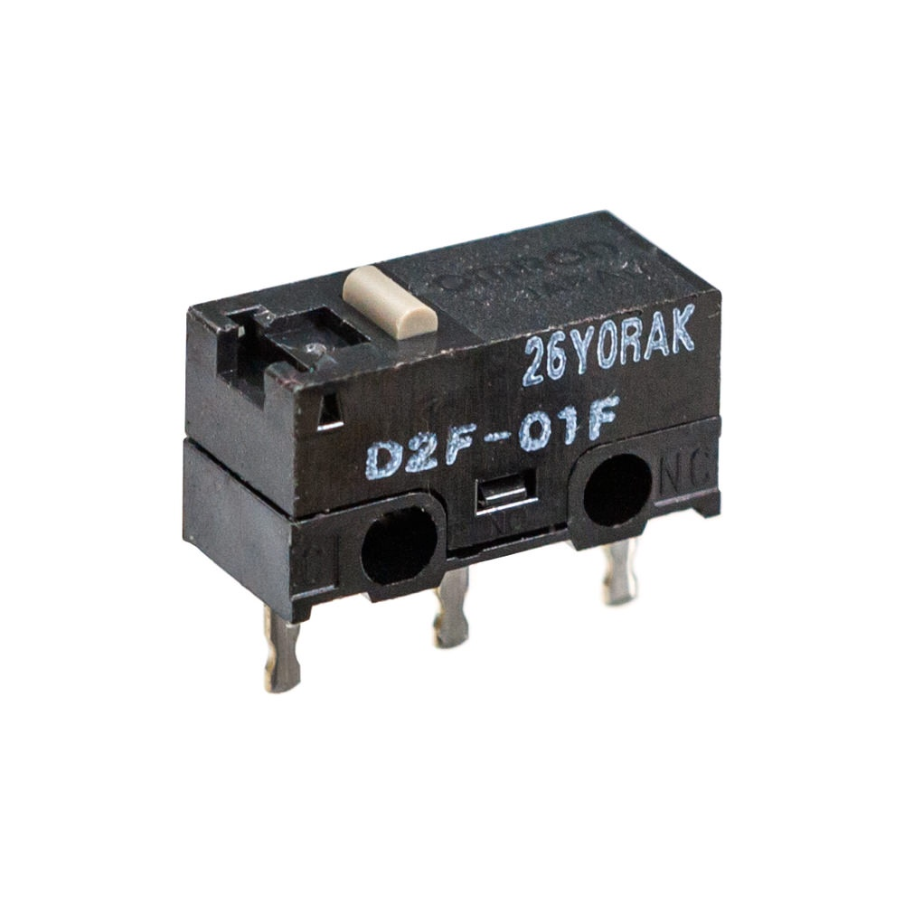
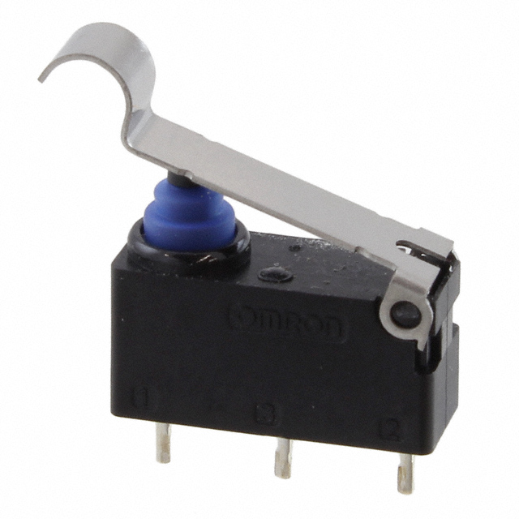
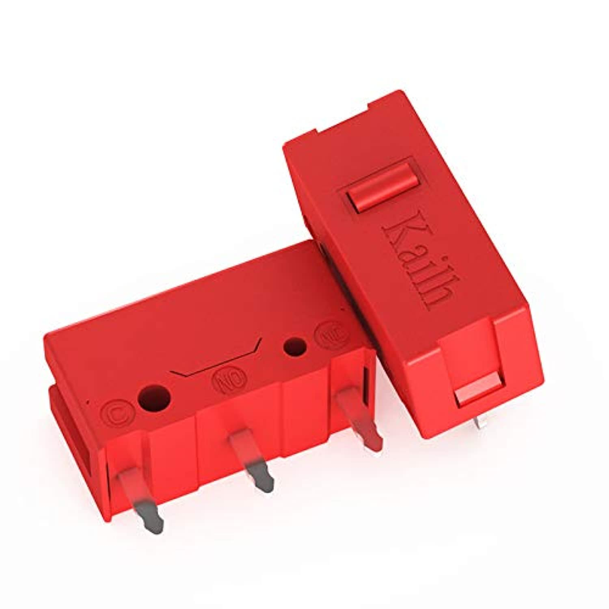
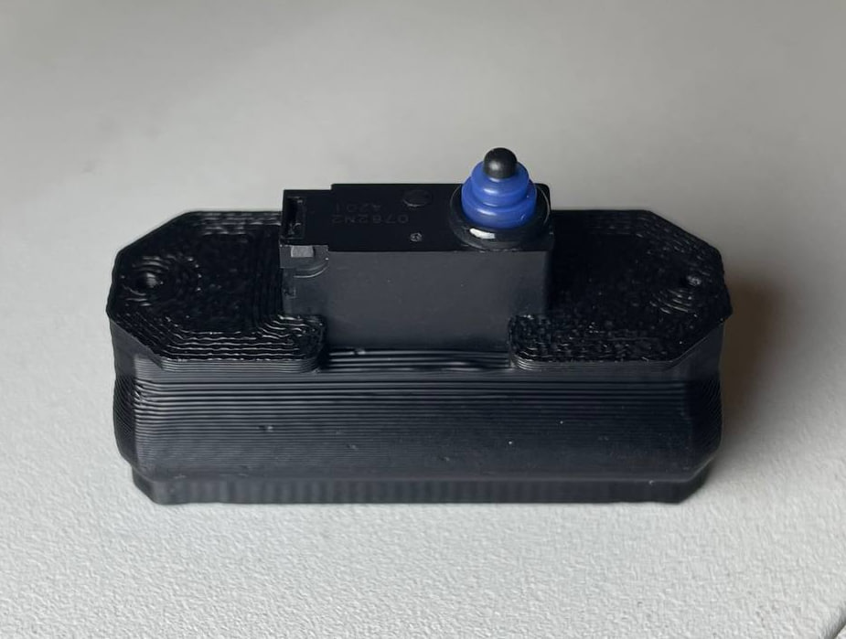

# Microswitches accuracy for Z endstop \ probe usage
## Contender list
- Omron D2F-01F Japan (China versions have different actuation force and considered subpar to Omron Japan)
- Omron D2HW-A201
- Omron D2HW-A231
- Kailh GM4.0 Red

## Test method used
Since Voron 0 is running klipper with slide-swipe probe mod it makes sense just to use `PROBE_ACCURACY` command. To have better result series of 100 used. `PROBE_SPEED` is set to 5mm\s because I found faster and slower speeds can impact the accuracy results. So ho,ing with fast initial tap and actual measurement at calibrated speed makes sense.

Resulting test command as follows: `PROBE_ACCURACY SAMPLES=100 PROBE_SPEED=5` 

### Omron D2F-01F

`// probe accuracy results: maximum 16.794375, minimum 16.775000, range 0.019375, average 16.788169, median 16.788750, standard deviation 0.003074`

### Omron D2HW-A201

`// probe accuracy results: maximum 16.788750, minimum 16.778125, range 0.010625, average 16.782444, median 16.781875, standard deviation 0.002536`

### Omron D2HW-A231

`// probe accuracy results: maximum 16.801250, minimum 16.788125, range 0.013125, average 16.792156, median 16.790937, standard deviation 0.003318`

### Kailh GM4.0 Red

`// probe accuracy results: maximum 13.122500, minimum 13.103125, range 0.019375, average 13.115475, median 13.115000, standard deviation 0.002359`

## Update for D2HW-A201
Since the original SlideSwipe probe is designed for D2F series in the mount place I had to file down probe body to mount D2HW series. Though giving better results it wasn't good enough and not sitting snug so I modified probe body for D2HW series so repeatability probably would be improved. Behold the probe:

Even any of tested probes should give enough accuracy for basic 0.04mm step repeatability when homing I like better numbers so I am pleased with result:

`// probe accuracy results: maximum 17.534375, minimum 17.526875, range 0.007500, average 17.529656, median 17.529375, standard deviation 0.001580`

P.S. D2HW-A231 wasn't retested with new mount but it won't reach the same accuracy and I am not interested in even longer press.

## Results and conclusions

| Switch    | range(min-max) | stdev    |
|-----------|----------------|----------|
| D2F-01F   | 0.019375       | 0.003074 |
| D2HW-A201 | 0.007500       | 0.001580 |
| D2HW-A231 (lever) | 0.013125 | 0.003318 |
| Kailh GM4.0 | 0.019375 | 0.002359 |

- Basically any switch except maybe cheapest noname used is enough for preciese homing and bed mesh measurement if you havestrudy and reliable mount, magnets not falling out of plastic parts etc.
- D2HW-A231 or possibly any switch with lever less accurate than regular switch. I was told othervise before and wasn't agreeing with that. So I did this test so you don't have to.
- For sure D2HW series is better than D2F-01 series when it comes to accuracy. Also I find longer press is better because 0.4 or something mm press on D2F-01 might ram the bed without triggering if bed is tilted so D2HW wins for me because I need less interactions manually with printer.
- Optical Omron like D2FP-FN2 might be even more accurate IMO but I don't have yet schematic that will be accurate and reliable for the tests.
- Do speed test for better acuracy. `SPEED=5` was my sweet spot where repeated tests had better accuracy (slower not always better though). This won't really affect homing speed in comparison with 1h print. Mesh leveling will take more time for sure but if you do mesh leveling every print - you doing something wrong.
